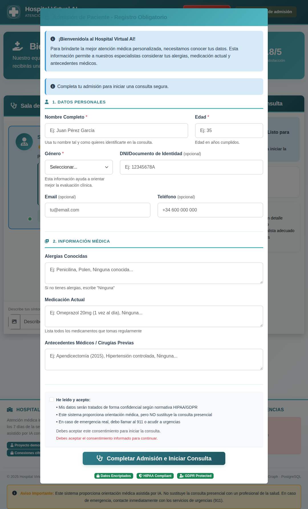
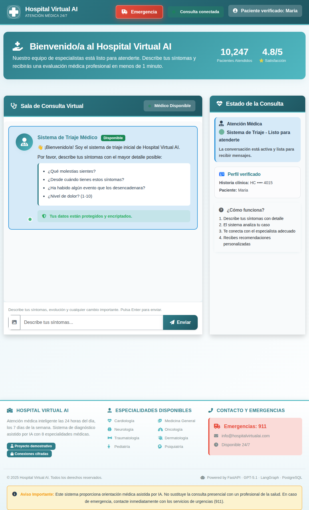
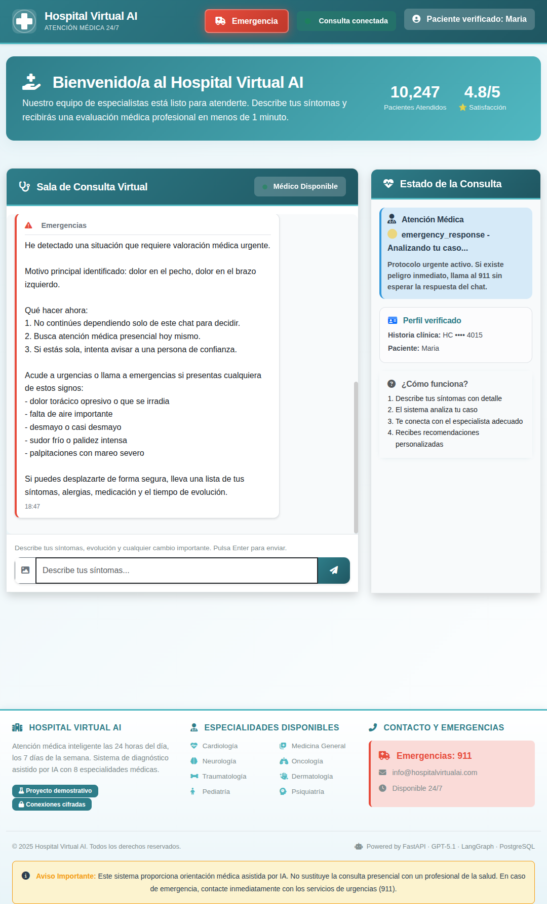

# LangGraph Medical Center

Multi-agent medical consultation system with parallel specialist evaluation, real-time streaming, and persistent memory. Built with LangGraph, FastAPI, PostgreSQL, and WebSocket.



## Screenshots

### Dashboard -- Consultation Room


### Triage Agent -- Emergency Protocol


### Full Platform View


## How It Works

```
Patient -> Triage -> [8 Specialists in Parallel] -> Consensus -> Selected Specialist
                                                                        |
                                                                  Conversational Chat
```

A patient describes their symptoms. The triage agent analyzes urgency and routes to **8 medical specialists** evaluating simultaneously. A consensus agent selects the best match, then the patient enters a conversational chat with that specialist -- all backed by persistent PostgreSQL memory and LangGraph checkpointing.

### Medical Specialists

| # | Specialist | Scope |
|---|-----------|-------|
| 1 | General Medicine | Primary care, general symptoms |
| 2 | Cardiology | Cardiovascular |
| 3 | Neurology | Nervous system |
| 4 | Pediatrics | Children and adolescents |
| 5 | Dermatology | Skin, hair, nails |
| 6 | Traumatology | Bones, joints, injuries |
| 7 | Psychiatry | Mental health |
| 8 | Oncology | Cancer detection and follow-up |

## Tech Stack

| Layer | Technology |
|-------|-----------|
| Orchestration | LangGraph 1.0 (parallel state machine) |
| LLM | Groq API (Llama 4 Scout / OpenAI-compatible) |
| Backend | FastAPI + Uvicorn (async, 4 workers) |
| Database | PostgreSQL 15 (conversations + LangGraph checkpoints) |
| Real-time | WebSocket (Socket.IO) |
| Auth | JWT + HMAC session cookies, HIPAA/GDPR consent |
| Frontend | Jinja2 templates + D3.js graph visualization |
| Packaging | UV (fast Python package manager) |
| Deploy | Docker Compose (multi-stage, non-root) |

## Architecture

```
src/
  agents/                   # Medical agents
    base_agent.py           # Abstract base class
    triage_agent.py         # Triage routing
    consensus_agent.py      # Specialist selection
    agent_factory.py        # Agent factory
    specialists/            # 8 specialist implementations
  graph/                    # LangGraph orchestration
    state.py                # Graph state schema
    nodes.py                # Node functions
    medical_graph.py        # Graph construction
  memory/                   # Conversation persistence
    conversation_memory.py
  models/                   # Pydantic data models
  services/                 # LLM + Database services
  web/                      # FastAPI app
    main.py                 # Lifespan, middleware, CORS
    routers/                # REST endpoints
    websocket/              # Socket.IO chat handler
    templates/              # Jinja2 HTML
    static/                 # CSS, JS, D3 visualization
  config/                   # Pydantic settings + agent prompts
  utils/                    # Logging, validators
tests/                      # pytest (70%+ coverage enforced)
docker/                     # Dockerfile + docker-compose.yml
```

**48 source files, ~6300 LOC.** Strict mypy, ruff linting, parametrized SQL (zero injection), retry with exponential backoff (tenacity), structured logging throughout.

## Quick Start

### Docker (recommended)

```bash
git clone https://github.com/infantesromeroadrian/LangGraph-Agents-HospitalCenter.git
cd LangGraph-Agents-HospitalCenter
cp .env.example .env
# Edit .env with your Groq API key

cd docker
docker compose up --build
```

### Local (with UV)

```bash
# Requires PostgreSQL running on localhost:5432
cp .env.example .env
# Edit .env with your credentials

uv sync
uv run python -m uvicorn src.web.main:app --host 0.0.0.0 --port 5000
```

### Access

| Service | URL |
|---------|-----|
| Web UI | http://localhost:5000 |
| Swagger API | http://localhost:5000/docs |
| Health Check | http://localhost:5000/health |
| PgAdmin (dev) | http://localhost:5050 |

## Environment Variables

| Variable | Description | Required |
|----------|-------------|----------|
| `OPENAI_API_KEY` | Groq/OpenAI API key | Yes |
| `OPENAI_BASE_URL` | API endpoint | Yes |
| `OPENAI_MODEL` | LLM model name | Yes |
| `DATABASE_URL` | PostgreSQL connection string | Yes |
| `APP_SECRET_KEY` | Session signing key (32+ chars) | Yes |
| `JWT_SECRET_KEY` | JWT signing key | Yes |

See `.env.example` for the full list with defaults.

## API

### REST

- `POST /api/patients` -- Register patient (returns auth cookie)
- `POST /api/sessions` -- Start consultation session
- `GET /api/sessions/{id}/messages` -- Retrieve message history
- `GET /health` -- Service health + dependency status

### WebSocket Events

| Event | Direction | Description |
|-------|-----------|-------------|
| `join_session` | Client -> Server | Join consultation |
| `send_message` | Client -> Server | Send symptoms/message |
| `agent_response` | Server -> Client | Specialist response |
| `graph_update` | Server -> Client | Graph state change |
| `thinking` | Server -> Client | Processing indicator |

## Testing

```bash
uv run pytest tests/ -v --cov=src    # Full suite
uv run pytest tests/test_agents.py   # Agent tests
uv run pytest tests/test_graph.py    # Graph tests
uv run pytest tests/test_memory.py   # Memory tests
```

## Security

- Parametrized SQL queries (zero injection surface)
- JWT + HMAC cookie authentication
- Configuration validation at startup (rejects placeholder secrets)
- Non-root Docker containers
- Security headers (CSP, X-Frame-Options, CORS)
- Rate limiting (120 req/min read, 30 req/min write)
- HIPAA/GDPR consent flow before data collection

## License

Copyright (c) 2025-2026 Adrian Infantes Romero. **All rights reserved.**

This software is proprietary. See [LICENSE](LICENSE) for full terms.

---

Built by [Adrian Infantes](https://github.com/infantesromeroadrian)
